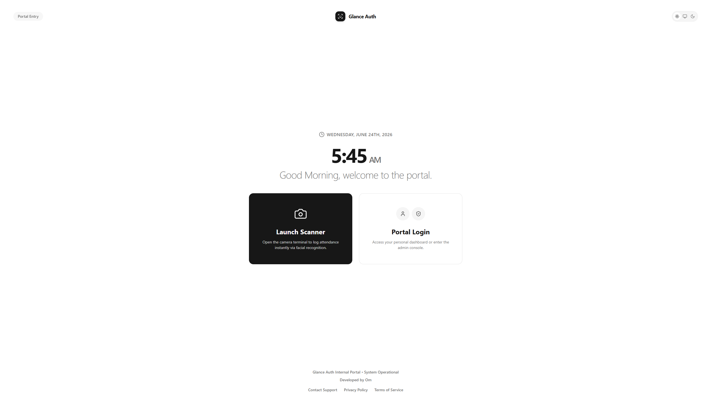
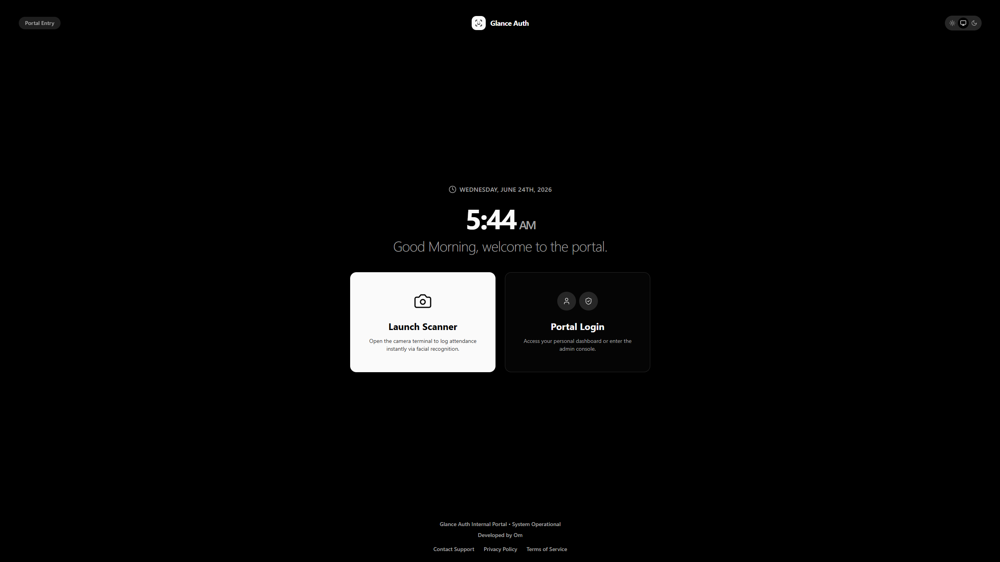
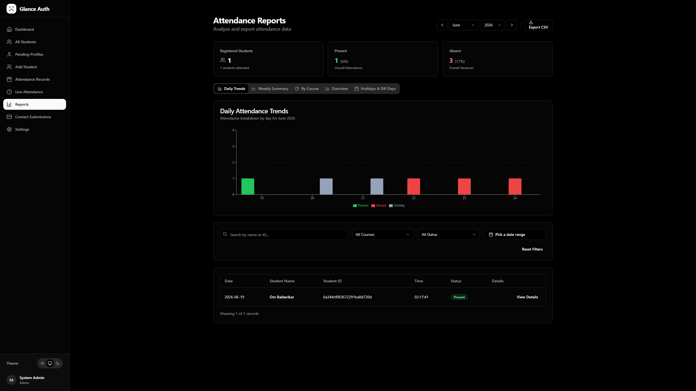

# Glance Auth

Glance Auth is a facial recognition-based authentication and attendance tracking system. It provides a seamless way for institutions to automate attendance marking through facial detection, complete with comprehensive dashboards for both administrators and students.

## Features

*   **Facial Recognition Attendance**: Automated attendance marking using computer vision.
*   **Role-Based Access Control**: Separate interfaces and privileges for Administrators and Students.
*   **Admin Dashboard**: Manage students, courses, enrollment requests, and view detailed attendance statistics and system settings.
*   **Student Dashboard**: View personal attendance records, monthly statistics, and manage profile data including facial encodings.
*   **Automated Scheduling**: Configure automatic marking of absent students at the end of the day.
## Screenshots

### Portal Entry (Light Mode)


### Portal Entry (Dark Mode)


### Admin Dashboard (Reports)


## Technology Stack

*   **Frontend**: React (Vite), TypeScript, Tailwind CSS
*   **Backend**: Python, Flask, Flask-JWT-Extended
*   **Database**: MongoDB
*   **Computer Vision**: `face_recognition` library (dlib)

## Prerequisites

Before running the application, ensure you have the following installed:

*   Node.js (v18 or higher)
*   Python (3.8 or higher)
*   MongoDB (running locally on port 27017, or a valid MongoDB URI)
*   C++ Build Tools (required for compiling the `dlib` dependency for face recognition)

## Local Development Setup

### 1. Database Setup

Ensure your MongoDB service is running. By default, the application will attempt to connect to `mongodb://localhost:27017/attendance_system`.

### 2. Backend Setup

Navigate to the backend directory and install the required dependencies:

```bash
cd backend

# Install dependencies
pip install -r requirements.txt

# Start the Flask server
python app.py
```
The backend server will start on `http://localhost:5000`.

### 3. Frontend Setup

In a new terminal window, navigate to the frontend directory:

```bash
cd frontend

# Install dependencies
npm install

# Start the development server
npm run dev
```
The frontend application will be available at `http://localhost:8080` (or another port depending on Vite's configuration).

## Hosting and Deployment

### Frontend Deployment (Cloudflare Pages)
The React frontend is a static application and is perfectly suited for **Cloudflare Pages**, Vercel, or Netlify.

To deploy to Cloudflare Pages:
1. Connect your GitHub repository to your Cloudflare account.
2. Set the framework preset to **Create React App** or **Vite**.
3. Build command: `npm run build`
4. Build output directory: `dist`

### Backend Deployment (Important Note)
The Python backend **CANNOT** be hosted on serverless platforms like Cloudflare Workers or Vercel Serverless. This is because the `face_recognition` library relies on `dlib`, which is a heavy C++ dependency that requires a traditional Linux environment with sufficient RAM.

For the backend, you must use a VPS or Docker-supported PaaS such as:
- **Railway**, **Render**, or **Fly.io** (Using a Dockerfile)
- **DigitalOcean Droplet**, **AWS EC2**, or **Linode** (Running Linux)

For production, ensure the Flask application is served using a production WSGI server such as Gunicorn, and allocate at least 1GB to 2GB of RAM to handle facial encoding matrices.

## Project Structure

*   `/backend`: Contains the Python Flask API, authentication logic, database models, and computer vision modules.
*   `/frontend`: Contains the React application, routing, UI components, and API integration services.

## License

This project is licensed under the MIT License - open for educational purposes, modifications, and general use.
